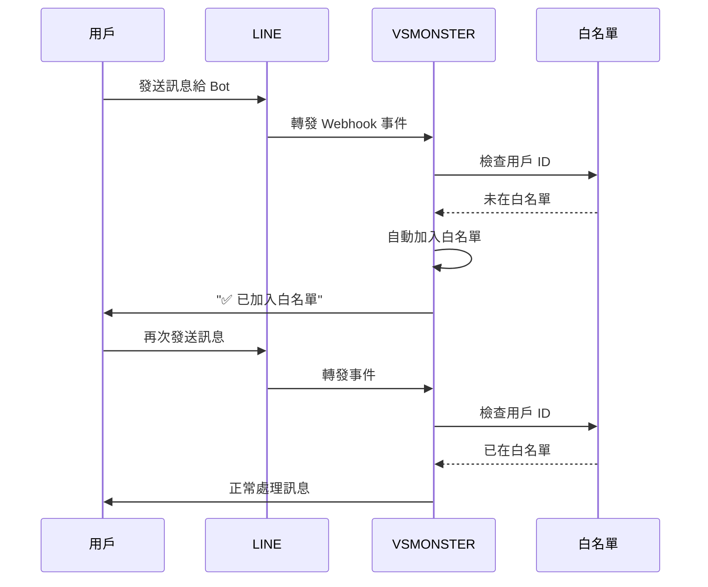

# LINE Webhook 安全設定教學

## 📋 概述

本教學將指導你如何設定 VSMONSTER 的 LINE Webhook 安全功能，包括：
- 隨機 Webhook URL
- 白名單機制
- Token 驗證

## 🔐 安全功能說明

### 1. 隨機 Webhook URL

**為什麼需要？**
防止惡意用戶猜測 webhook URL 並發送假請求。

**如何運作？**
```
傳統 URL：https://your-domain.com/webhook/line
安全 URL：https://your-domain.com/webhook/line/a1b2c3d4e5f6789abcdef...
```

URL 尾部的隨機字串只有你知道，即使有人知道你的域名，也無法向你的 Bot 發送請求。

### 2. 白名單機制

**為什麼需要？**
確保只有授權的用戶可以使用你的 VSMONSTER Bot。

**首次使用流程：**



### 3. Token 驗證

**如何運作？**
每個來自 LINE 的請求都包含 `x-line-signature` header，VSMONSTER 會驗證這個簽名確保請求來自 LINE 官方。

## 🛠️ 設定步驟

### 步驟 1: 配置 LINE Channel

1. 前往 [LINE Developers Console](https://developers.line.biz/)
2. 選擇你的 Messaging API Channel
3. 取得以下資訊：
   - Channel Access Token
   - Channel Secret

### 步驟 2: 在 VSCode 中設定憑證

**方法 A：使用 VSCode 設定（推薦）**

1. 開啟 VSCode 設定 (`Cmd/Ctrl + ,`)
2. 搜尋 "vsmonster"
3. 填入以下設定：

```json
{
  "vsmonster.channels.line.channelAccessToken": "你的 Channel Access Token",
  "vsmonster.channels.line.channelSecret": "你的 Channel Secret"
}
```

**方法 B：使用 config.json**

編輯 `configs/config.json`：

```json
{
  "channels": {
    "line": {
      "channelAccessToken": "你的 Channel Access Token",
      "channelSecret": "你的 Channel Secret",
      "webhookSecret": "自訂的隨機字串（選填）",
      "whitelist": []
    }
  }
}
```

### 步驟 3: 啟動 Gateway 並取得 Webhook URL

1. 啟動 VSMONSTER Gateway：
   ```bash
   pnpm dev
   ```

2. 查看終端輸出，找到類似這樣的訊息：
   ```
   INFO: LINE webhook path: /webhook/line/a1b2c3d4e5f6789abcdef0123456789
   INFO: Complete webhook URL: https://your-tunnel-url.com/webhook/line/a1b2c3d4e5f6789abcdef0123456789
   ```

3. 複製完整的 webhook URL

### 步驟 4: 在 LINE 設定 Webhook URL

1. 回到 LINE Developers Console
2. 進入你的 Channel 設定
3. 找到 "Webhook settings"
4. 貼上完整的 webhook URL
5. 點擊 "Verify" 驗證連接
6. 啟用 "Use webhook"

### 步驟 5: 首次測試

1. 用你的 LINE 帳號發送訊息給 Bot（任何訊息都可以）
2. 你應該會收到：
   ```
   ✅ 你已被加入白名單，現在可以使用 VSMONSTER 了！
   ```
3. 現在再發送任何訊息，Bot 就會正常回應了

## 📋 白名單管理

### 查看當前白名單

在 VSCode 設定中查看：
```json
{
  "vsmonster.channels.line.whitelist": [
    "U1234567890abcdef",
    "U0987654321fedcba"
  ]
}
```

### 手動添加用戶

**如何取得 LINE User ID？**

1. 讓用戶發送任何訊息給 Bot
2. 查看 Gateway 日誌：
   ```
   INFO: First time user detected: U1234567890abcdef
   ```
3. 複製這個 User ID
4. 添加到設定：
   ```json
   {
     "vsmonster.channels.line.whitelist": ["U1234567890abcdef"]
   }
   ```

### 移除用戶

從白名單陣列中刪除該 User ID：
```json
{
  "vsmonster.channels.line.whitelist": []  // 清空白名單
}
```

### 允許所有人使用（不推薦）

將白名單設為空陣列：
```json
{
  "vsmonster.channels.line.whitelist": []
}
```

## 🔒 安全最佳實踐

### 1. 定期更換 Webhook Secret

```bash
# 生成新的隨機字串
node -e "console.log(require('crypto').randomBytes(32).toString('hex'))"

# 更新到設定中
{
  "vsmonster.channels.line.webhookSecret": "新的隨機字串"
}

# 重新啟動 Gateway 並更新 LINE Console 的 Webhook URL
```

### 2. 使用環境變數（生產環境）

```bash
# .env
LINE_CHANNEL_ACCESS_TOKEN=你的token
LINE_CHANNEL_SECRET=你的secret
LINE_WEBHOOK_SECRET=你的webhook密鑰
```

```typescript
// 在程式碼中使用
const config = {
  channelAccessToken: process.env.LINE_CHANNEL_ACCESS_TOKEN,
  channelSecret: process.env.LINE_CHANNEL_SECRET,
  webhookSecret: process.env.LINE_WEBHOOK_SECRET,
};
```

### 3. 監控異常請求

查看 Gateway 日誌，注意這些警告：
```
WARN: LINE webhook request without signature header
WARN: LINE webhook invalid secret in URL
WARN: User U123... not in whitelist, rejecting request
```

### 4. HTTPS Only

**永遠使用 HTTPS！** LINE 只接受 HTTPS 的 webhook URL。

使用 Cloudflare Tunnel 或 ngrok 來提供 HTTPS：

```bash
# Cloudflare Tunnel
cloudflared tunnel --url http://localhost:3000

# ngrok
ngrok http 3000
```

## ⚠️ 常見問題

### Q1: 白名單用戶無法使用 Bot？

**檢查清單：**
- [ ] User ID 是否正確？
- [ ] VSCode 設定是否已保存？
- [ ] Gateway 是否已重新啟動？
- [ ] 白名單陣列格式是否正確？

**除錯方法：**
```bash
# 查看日誌
tail -f gateway.log | grep whitelist
```

### Q2: Webhook URL 驗證失敗？

**可能原因：**
1. Webhook Secret 不一致
2. URL 格式錯誤
3. Gateway 未運行

**解決方法：**
1. 確認 Gateway 正在運行
2. 複製完整的 URL（包含隨機字串）
3. 檢查防火牆設定

### Q3: 如何重置所有設定？

```bash
# 停止 Gateway
# 刪除配置
rm configs/config.json

# 清除 VSCode 設定
# 在 VSCode 設定中搜尋 "vsmonster" 並重置所有值

# 重新開始設定流程
```

### Q4: 收不到首次使用的白名單確認訊息？

**檢查：**
1. Gateway 日誌是否顯示 "First time user detected"
2. 確認 LINE Bot 有發送訊息的權限
3. 檢查 Channel Access Token 是否有效

## 📊 進階配置

### 動態白名單管理 API

未來版本將提供 API 來管理白名單：

```typescript
// 添加用戶
POST /api/whitelist/line
{
  "userId": "U1234567890abcdef"
}

// 移除用戶
DELETE /api/whitelist/line/U1234567890abcdef

// 列出所有白名單用戶
GET /api/whitelist/line
```

### 白名單過期機制

可以設定白名單用戶的過期時間：

```json
{
  "vsmonster.channels.line.whitelist": [
    {
      "userId": "U1234567890abcdef",
      "expiresAt": "2026-12-31T23:59:59Z",
      "note": "測試帳號"
    }
  ]
}
```

---

**最後更新：** 2026-02-01  
**版本：** v0.1.0  
**相關文件：** [UPDATE-NOTES.md](../archive/UPDATE-NOTES.md)
